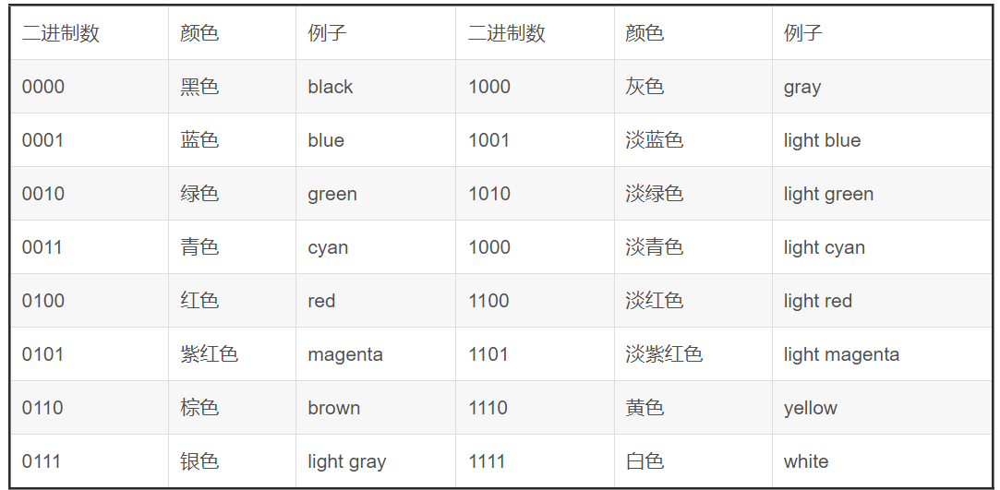

## 编译boot.asm

```bash
dd if=/dev/zero of=mysticalos.img bs=512 count=2880
```

```bash
nasm ./src/boot/boot.asm -o ./boot.bin
```

## 将boot.bin写入软盘
```bash
dd if=boot.bin of=mysticalos.img bs=512 count=1 conv=notrunc
```


