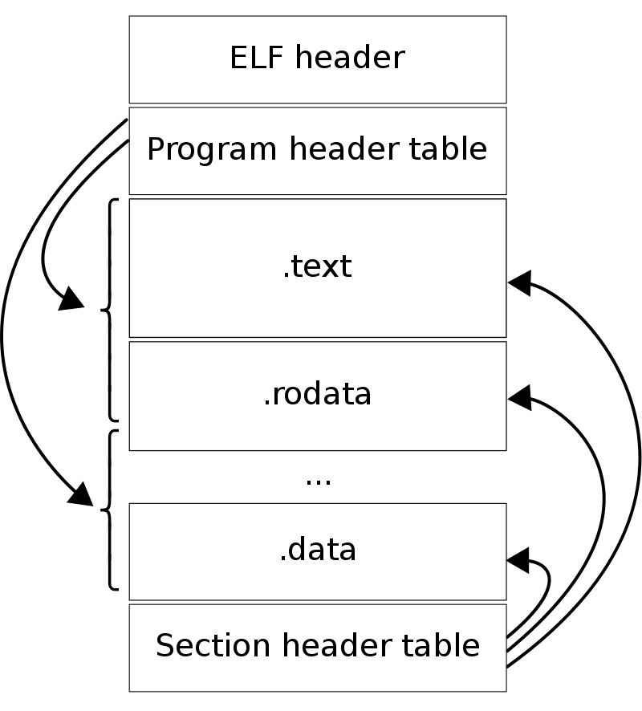
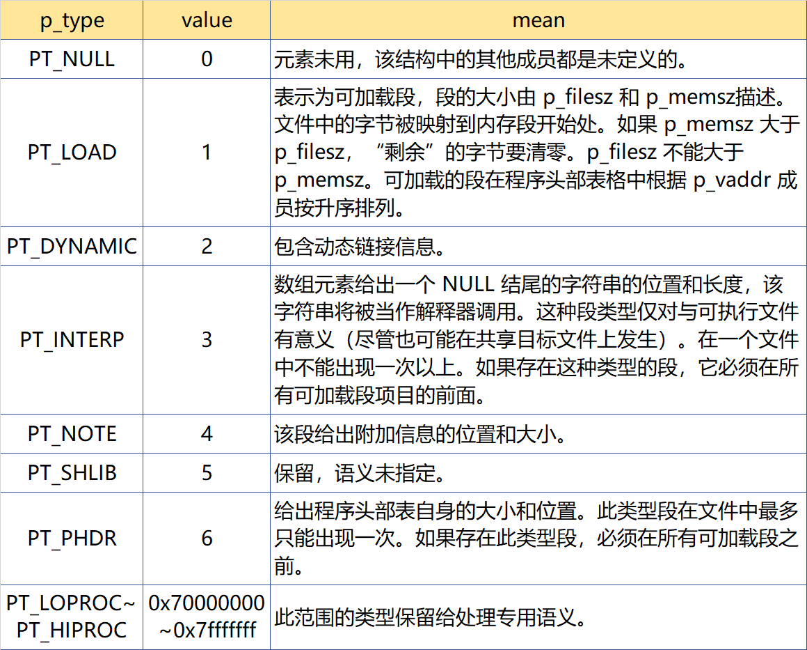

# elf32文件格式

```bash
nasm -f elf -o kernel.o src/kernel/kernel.asm
nasm -f elf -o kernel_386lib.o src/kernel/kernel_386lib.asm 
gcc -c -o main.o src/kernel/main.c
ld -Ttext 0x1000 -o kernel2.bin kernel.o main.o kernel_386lib.o


sudo mount -o loop mysticalos.img /mnt/floppy/
sudo cp -fv kernel.bin  /mnt/floppy/ 
sudo umount /mnt/floppy
```

## 组成：

>由4部分组成：ELF头（ELF header）、程序头表（Program header table）
、节/段（Sections）以节头表（Section header table）。
一个ELF文件不一定会包含以上这些全部内容， 位置也不一定像图中一样，但是，有一个东西是固定的：
ELF header，其他的各部分信息，都由ELF header里的值来决定。
 
>ELF文件有两种索引：程序标头中记载了运行时所需的“段”，而段首地址表记载了二进制文件中“段”的首地址

- ELF头：

```c
  #define EI_NIDENT 16

typedef struct {
    //这个字节序列指定了文件的解释方式，与处理器或文件的其余内容无关。在这个字节序列中，所有内容都由宏命名，这些宏以 EI_ 前缀开头，可能包含以 ELF 前缀开头的值。
    unsigned char e_ident[EI_NIDENT];
    //用于标识对象文件的类型。
    uint16_t      e_type;
    //指定了单个文件所需的架构。
    uint16_t      e_machine;
    uint32_t      e_version;
    //入口点地址
    //系统首先将控制权转移到的虚拟地址，从而启动该进程。如果文件没有关联的入口点，则此成员保留零。
    ElfN_Addr     e_entry;
    //程序头表偏移 uint32_t
    ElfN_Off      e_phoff;
    //节头表偏移 uint32_t
    ElfN_Off      e_shoff;
    //此成员持有与文件相关联的机器特定标志。标志名称采用 EF_`machine_flag' 的形式。目前没有定义任何标志。
    uint32_t      e_flags;
    //此成员保存 ELF 头部的大小,单位为字节。
    uint16_t      e_ehsize;
    //此成员保存文件程序头表每个条目的大小,以字节为单位;所有条目的大小都相同。
    uint16_t      e_phentsize;
    //此成员保存程序头表中的条目数量。
    // 因此,e_phentsize 和 e_phnum 的乘积给出表的大小(以字节为单位)。
    // 如果文件没有程序头,则 e_phnum 值为 0。
    //如果程序头表中的条目数量大于或等于 PN_XNUM(0xffff),
    //则此成员保存 PN_XNUM(0xffff),
    // 节头表中第一个条目的 sh_info 成员保存真实的程序头表中的条目数量。否则,节头表中第一个条目的 sh_info 成员保存值为 0。
    uint16_t      e_phnum;
    //此成员保存节头的大小,单位为字节。节头是节头表中的一个条目;所有条目的大小相同。
    uint16_t      e_shentsize;
    //此成员保存节头表中的条目数量。
    //因此,e_shentsize 和 e_shnum 的乘积给出节头表的大小(以字节为单位)。
    //如果文件没有节头表,e_shnum 值为 0。
    //如果节头表中的条目数量大于或等于 SHN_LORESERVE(0xff00),
    //则 e_shnum 值为 0,节头表中第一个条目的 sh_size 成员保存节头表中的真实条目数量。
    // 否则,节头表中第一个条目的 sh_size 成员值为 0。
    uint16_t      e_shnum;
    //此成员保存与节名称字符串表关联的节头表索引。
    // 如果文件没有节名称字符串表,则此成员保存值为 SHN_UNDEF。
    //如果节名称字符串表节的索引大于或等于 SHN_LORESERVE(0xff00),
    //则此成员保存 SHN_XINDEX(0xffff),节名称字符串表节的真实索引放在节头表第一个条目的 sh_link 成员中。
    // 否则,节头表第一个条目的 sh_link 成员的值为 0。
    uint16_t      e_shstrndx;
} ElfN_Ehdr;
```

- 程序头 Program header (Phdr):
```c
typedef struct {
    uint32_t   p_type;
    //这个成员保存了段的第一个字节所在的文件开头的偏移量。
    Elf32_Off  p_offset;
    //此成员保存段的第一个字节驻留在内存中的虚拟地址
    Elf32_Addr p_vaddr;
    //对于涉及物理寻址的系统，此成员保留用于段的物理地址。在BSD中，此成员未使用且必须为零。
    Elf32_Addr p_paddr;
    //此成员保存段的文件映像中的字节数。它可以为零。
    uint32_t   p_filesz;
    //此成员保存段的内存映像中的字节数。它可以为零。
    uint32_t   p_memsz;
    //此成员保存与段相关的标志的位掩码
    uint32_t   p_flags;
    uint32_t   p_align;
} Elf32_Phdr;
```
>可执行文件或共享对象文件的程序头表是一个结构体数组，
> 每个结构体描述一个段或其他系统需要准备程序执行所需的信息。
> 一个对象文件段包含一个或多个节。
> 程序头只对可执行文件和共享对象文件有意义。
> 文件使用 ELF 头的 e_phentsize 和 e_phnum 成员指定自己的程序头大小。
> ELF程序头由类型Elf32_Phdr或Elf64_Phdr描述，具体取决于架构。

>p_type：该结构的成员指示此数组元素描述的段的类型或如何解释数组元素的信息。
>
>- PT_NULL：数组元素未使用，其他成员的值未定义。这使得程序头可以有被忽略的条目。
>- PT_LOAD：数组元素指定一个可加载的段，由p_filesz和p_memsz描述。文件中的字节被映射到内存段的开头。如果段的内存大小p_memsz大于文件大小p_filesz，则“额外”字节被定义为持有值0并且跟随段的初始化区域。文件大小不得大于内存大小。程序头表中的可加载段条目按照p_vaddr成员的升序出现。
>- PT_DYNAMIC：数组元素指定动态链接信息。
>- PT_INTERP：数组元素指定作为解释器调用的空终止路径名的位置和大小。该段类型仅适用于可执行文件（虽然它可能出现在共享对象中）。但是，它不能在文件中出现多次。如果存在，则必须在任何可加载段条目之前。
>- PT_NOTE：数组元素指定注释的位置（ElfN_Nhdr）。
>- PT_SHLIB：此段类型保留但没有指定的语义。包含此类型的数组元素的程序不符合ABI。
>- PT_PHDR：如果存在，则该数组元素指定程序头表本身在文件和程序的内存映像中的位置和大小。此段类型在文件中不能出现超过一次。此外，仅当程序头表是程序的内存映像的一部分时，才可以出现。如果存在，则必须在任何可加载段条目之前。
>- PT_LOPROC、PT_HIPROC：值在[PT_LOPROC，PT_HIPROC]的范围内保留供特定处理器使用的语义。
>- PT_GNU_STACK：Linux内核使用的GNU扩展，通过p_flags成员中设置的标志来控制堆栈的状态。



- section header:

```c
 typedef struct {
    uint32_t   sh_name;
    uint32_t   sh_type;
    uint32_t   sh_flags;
    Elf32_Addr sh_addr;
    Elf32_Off  sh_offset;
    uint32_t   sh_size;
    uint32_t   sh_link;
    uint32_t   sh_info;
    uint32_t   sh_addralign;
    uint32_t   sh_entsize;
} Elf32_Shdr;
```

>- sh_type：该成员将段的内容和语义分类。
>
>- SHT_NULL：该值将段头标记为未激活。它没有关联的段。段头的其他成员具有未定义的值。
>
>- SHT_PROGBITS：该段包含由程序定义的信息，其格式和含义完全由程序确定。
>
>- SHT_SYMTAB：该段包含符号表。通常，SHT_SYMTAB提供链接编辑的符号，但它也可以用于动态链接。作为完整的符号表，它可能包含许多对于动态链接不必要的符号。一个对象文件也可以包含一个SHT_DYNSYM段。
>
>- SHT_STRTAB：该段包含字符串表。一个对象文件可以有多个字符串表节。
>
>- SHT_RELA：该段包含具有显式加数的重定位条目，例如32位对象文件类别的Elf32_Rela类型。一个对象可以有多个重定位节。
>
>- SHT_HASH：该段包含符号哈希表。参与动态链接的对象必须包含符号哈希表。一个对象文件只能有一个哈希表。
>
>- SHT_DYNAMIC：该段包含动态链接信息。一个对象文件只能有一个动态节。
>
>- SHT_NOTE：该节包含以某种方式标记文件的信息。
>
>- SHT_NOBITS：该类型的节在文件中不占用任何空间，但在其他方面类似于SHT_PROGBITS。虽然此节不包含任何字节，但sh_offset成员包含概念文件偏移量。
>
>- SHT_REL：该节包含没有显式加数的重定位偏移，例如32位对象文件类别的Elf32_Rel类型。一个对象文件可以有多个重定位节。
>
>- SHT_SHLIB：该节保留但具有未指定的语义。
>
>- SHT_DYNSYM：该节包含最小的动态链接符号集。一个对象文件也可以包含一个SHT_SYMTAB节。
>
>- SHT_LOPROC：该值及其以上的值（包括SHT_HIPROC）保留给处理器特定的语义。
>
>- SHT_HIPROC：该值及其以下的值（包括SHT_LOPROC）保留给处理器特定的语义。
>
>- SHT_LOUSER：该值指定索引范围的下界，该索引范围保留给应用程序。
>
>- SHT_HIUSER：该值指定索引范围的上界，该索引范围保留给应用程序。SHT_LOUSER和SHT_HIUSER之间的节类型可以被应用程序使用，而不会与当前或未来的系统定义的节类型冲突。