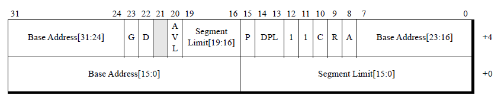

## 实模式

## 保护模式

> 当启用保护模式(CR0.PE=1)时，分段机制使用描述符表。
> 这些表保存描述段的位置、大小和权限属性的描述符条目。保护模式中的所有内存引用都访问描述符表条目。
> x86分段机制支持三种类型的描述符表：
> - 全局描述符表(GDT)。
> - 本地描述符表(LDT)。
> - 中断描述符表(IDT)。
>
> 软件通过初始化其相应的描述符表寄存器来确定描述符表在存储器中的位置

### 全局描述符表（GDT | Global Descriptor Table）

> 在32位保护模式中，段与段之间是互相隔离的，当访问的地址超出段的界限时处理器就会阻止这种访问，
> 因此每个段都需要有起始地址、范围、访问权限以及其他属性四个部分，这四个部分合在一起叫做段描述符（Segment Descriptor），
> 总共需要8个字节来描述。但Intel为了保持向后兼容，将段寄存器仍然规定为16-bit，
> 显然我们无法用16-bit的段寄存器来直接存储64-bit的段描述符。解决的办法是将所有64-bit的段描述符放到一个数组中，
> 将16-bit段寄存器的值作为下标来访问这个数组（以字节为单位），获取64-bit的段描述符，
> 这个数组就叫做全局描述符表（Global Descriptor Table, GDT）。

> 保护模式系统软件必须创建全局描述符表(GDT)。
> GDT包含可由所有任务共享的段的代码段和数据段描述符条目(用户段)。
> 除了用户段，GDT还可以保存门描述符和其他系统段描述符。
> 系统软件可以将GDT存储在内存中的任何位置，并且应该保护包含GDT的段不受非特权软件的影响。

### 本地描述符表（LDT | Local Descriptor Table）

> 保护模式系统软件可以选择创建本地描述符表(LDT)来保存属于单个任务甚至多个任务的段描述符。
> LDT通常包含由指定任务引用的代码段和数据段描述符以及门描述符。
> 与GDT类似，系统软件可以将LDT存储在内存中的任何位置，并应保护包含LDT的段不受非特权软件的影响。
>
>当选择器中的表索引位(TI)设置为1时，段选择器指向LDT。段选择子的选择子索引部分引用LDT中的特定条目。
> 然而，与GDT不同的是，选择子索引0引用LDT中的第一个条目(当TI=1时，选择子不是空选择子)。
>
> LDT 由位于 GDT 中的系统段描述符条目描述，一个 GDT 可以包含多个 LDT 描述符。 LDT 系统段描述符定义 LDT 的位置、大小和特权。
>
> 如果软件不使用 LDT，则将空选择器加载到 LDTR 中很有用

### 中断描述符表（IDT | Interrupt Descriptor Table）

> 系统软件可以维护多个IDT。
> 系统软件通过加载带有指向IDT的指针的中断描述符表寄存器(IDTR)来选择特定的IDT。
> 与GDT和LDT一样，系统软件可以将IDT存储在内存中的任何位置，并应保护包含IDT的段不受非特权软件的影响。
> IDT只能包含以下类型的门描述符：
>- 中断门
>- 陷阱门
>- 任务门
>
>如果中断或异常引用的IDT描述符不是上面列出的类型之一，则会发生一般保护异常(#GP)。

### 段选择子

> 当选择子中的表索引位(TI)清0时，段选择子指向GDT。段选择子的选择子索引部分引用GDT中的特定条目。
> 段选择子的一种特殊形式是空选择子。
> 空选择子指向GDT中的第一个条目(选择符子引为0且TI=0)。
> 但是，空选择子不引用内存，而是用于使未使用的段寄存器无效，因此第一个GDT条目不能用于描述段
>
> 空选择子只能加载到DS、ES、FS和GS数据段寄存器以及LDTR描述符表寄存器。
> 如果软件尝试使用空值加载CS寄存器，则会出现一般保护异常（general-protection exception）。

`下图显示了段选择子如何索引GDT`

### 段描述符格式

> 有两种基本类型的描述符，每一种都用于描述不同的段（或门）类型
> - 用户段 - 包括代码段和数据段。栈段是一种数据段。
> - 系统段 - 系统段由 LDT 段和任务状态段 (TSS) 组成。门描述符是另一种类型的系统段描述符。 门描述符不是描述段，而是指向程序入口点。

下图显示了用户段和系统段描述符的通用格式。
用户段和系统段使用 S 位区分。
S=1表示用户段，S=0表示系统段。
灰色阴影表示该字段或位是保留的。
门描述符的格式不同于通用段描述符

#### 存储段描述符

下图显示了代码段描述符格式(灰色阴影表示该位是保留的)。
所有软件任务都需要将引用有效代码段描述符的段选择器加载到CS寄存器中。
代码段建立处理器的操作模式和执行特权。
代码段通常只包含指令，并且是只执行的，或者执行和只读的。
软件不能写入选择器引用代码段描述符的段。

下图显示了数据段描述符格式。
数据段包含不可执行信息，可以只读或读/写方式访问。
它们使用DS、ES、FS、GS或SS数据段寄存器引用。
DS数据段寄存器保存默认数据段的段选择子。
ES、FS和GS数据段寄存器保存当前软件任务可用的附加数据段的段选择子。

#### 系统描述符

系统描述符一般有两种类型：
系统段描述符和门描述符。
系统段描述符用于描述LDT和TSS段。
门描述符不描述段，而是保存指向代码段描述符的指针。
门描述符用于较低特权和较高特权软件之间的保护模式控制传输。

下图显示了用于引用LDT和TSS段的传统模式系统段描述符格式(灰色阴影表示该位被保留)。此格式也用于兼容模式。系统段的用法如下：
- LDT通常保存属于单个任务的段描述符
- TSS是用于保存处理器状态信息的数据结构。
当任务挂起时，处理器状态被保存在TSS中，
而当任务重新启动时，处理器状态从TSS恢复。
系统软件必须创建至少一个由任务寄存器tr引用的TSS。

