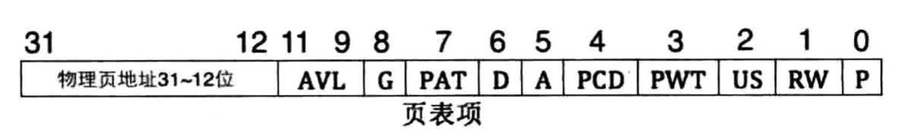
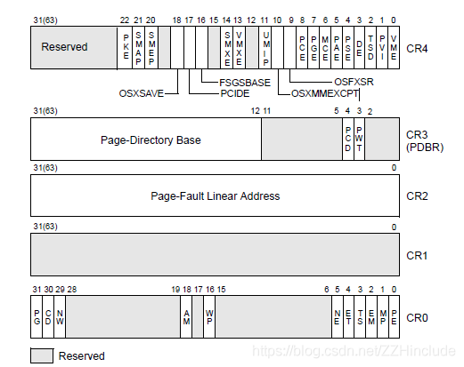
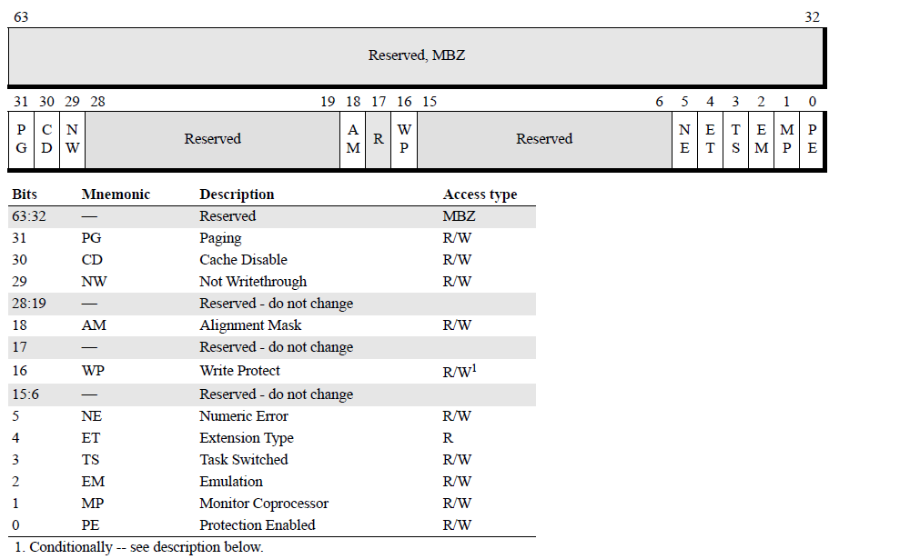

## 分页

从上图可以看出:
- 高20位用来表示物理地址。
- P：页式否存在物理内存中，1存在，0不存在
- US：若为1，表示处于User级，任意特权（0、1、2、3）的程序都可访问该页，0表示只允许特权级为0、1、2的程序访问该页
- D：脏页位，当CPU对一个页面进行写操作时，会设置该字段为1
- G：内存地址转换除了需要经过页表，后面我们还会降到经过页目录表，所以为了将提高速度，我们会将转化后的结果存储在快表（TLB）中。如果为1表示全局页，将会在TLB中保存，0则不保存。
- PWT：如果为1，表示该页不仅是普通内存，还是高速缓存
- PCD：如果为1，表示启用高速缓存，如果为0表示该页禁用高速缓存

CR寄存器

CR0

